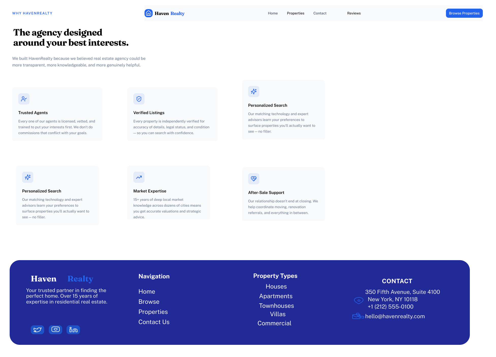
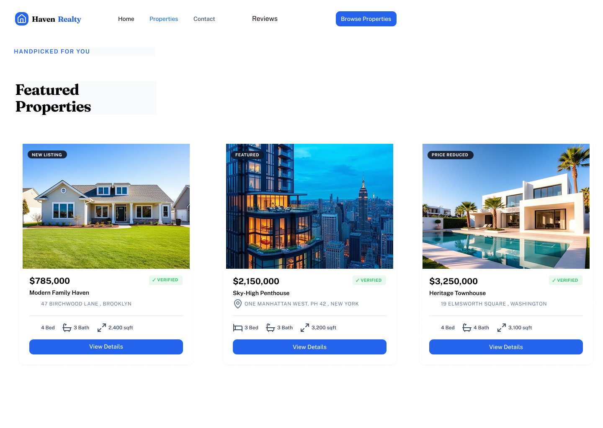
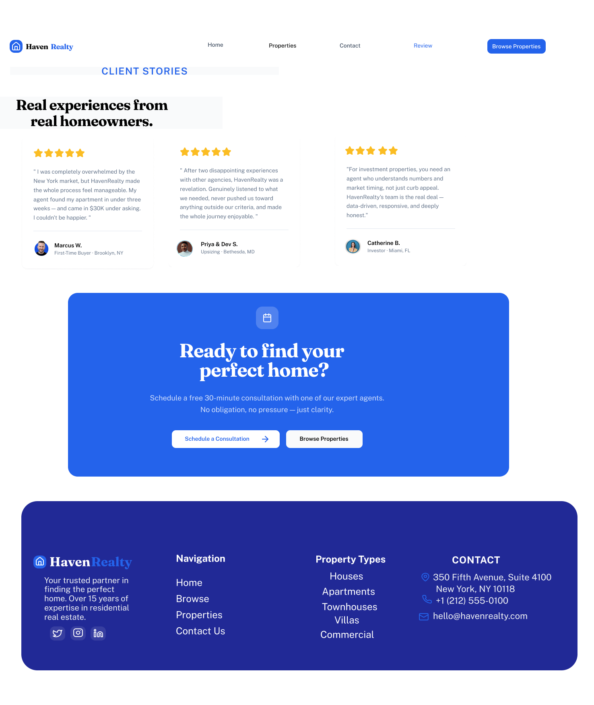
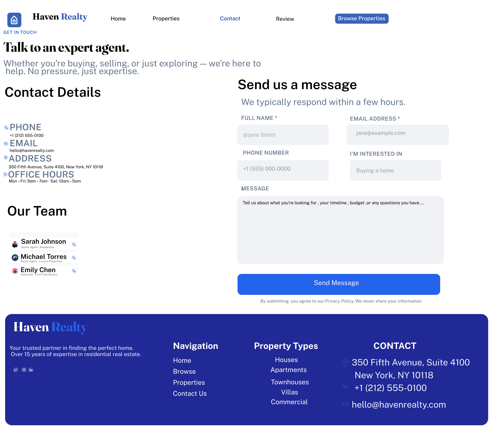

# 🏡 Dream Home Finder – UI/UX Case Study

---

## 📌 Project Description
Dream Home Finder is a UI/UX redesign project focused on creating a seamless and intuitive experience for users searching for properties online. The goal was to simplify the browsing process, improve usability, and design a conversion-focused interface that encourages users to explore listings and make inquiries بسهولة.

---

## ❗ Problem Statement
Many real estate platforms are cluttered, difficult to navigate, and lack clear user flows. Users often struggle to:
- Find relevant properties quickly  
- Filter listings efficiently  
- Trust the platform due to lack of reviews  
- Easily contact agents  

This leads to poor user experience and low conversion rates.

---

## 🎯 Project Objectives
- Simplify property search and browsing  
- Improve navigation and layout clarity  
- Enhance user trust through reviews  
- Create a smooth inquiry and booking flow  
- Design a modern and visually appealing interface  

---

## 👥 Target Users
- Home buyers looking for properties  
- Renters searching for homes  
- Property investors  
- Users who prefer simple and quick browsing experiences  

---

## 📱 Screen Designs

### 1. Home Page
- Clean hero section with property highlights  
- Clear call-to-action  
- Easy navigation  

### 2. Properties / Explore Page
- Card-based layout for listings  
- Filters for refined search  
- Structured browsing experience  

### 3. Review Page
- User testimonials  
- Builds trust and credibility  

### 4. Contact Page
- Minimal contact form  
- Quick inquiry process

- ## 📱 Screen Layouts

### 🏠 Home Screen

---

### 🔍 Explore Screen

---

### 🏡 Properties Screen

---

### ⭐ Review Screen

---

### 📞 Contact Screen

---

## 🔄 User Flow
1. User lands on the Home Page  
2. Browses featured properties  
3. Navigates to Explore Page  
4. Applies filters to find relevant listings  
5. Views property details  
6. Checks reviews for trust  
7. Contacts agent via Contact Page  

---

## 🎨 Design Approach
- Minimal and modern UI  
- Consistent blue & white color palette  
- Clear visual hierarchy  
- Focus on readability and spacing  
- User-friendly navigation  

---

## 🛠 Tools Used
- Figma (UI Design & Prototyping)

---

## 🚀 Key Screens
- Home Screen  
- Property Listing Screen  
- Review Screen  
- Contact Screen  

---

## 📌 Project Outcome
- Improved usability and navigation  
- Reduced user confusion  
- Enhanced user engagement  
- Better lead generation through clear CTAs  

---

## 🔗 Prototype Link
(Add your Figma prototype link here)

---

## 📄 Case Study Document
(Add your case study / PDF / portfolio link here)
